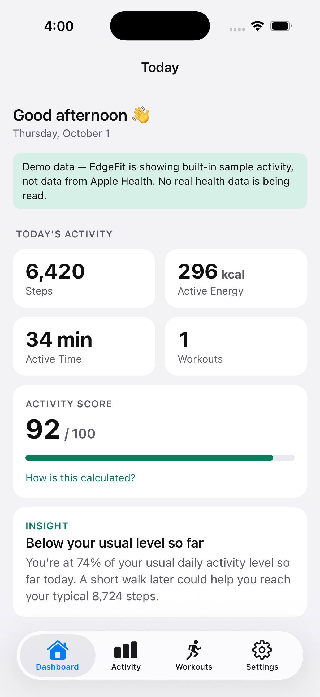
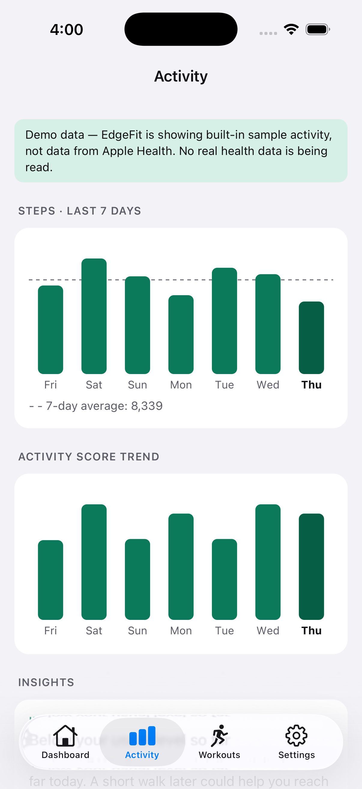
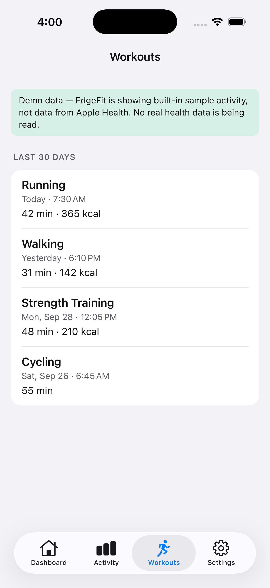
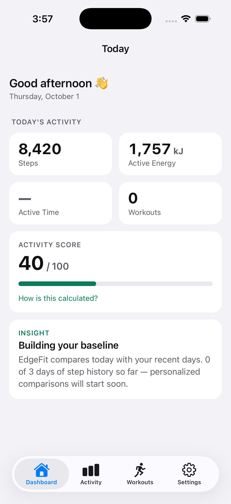
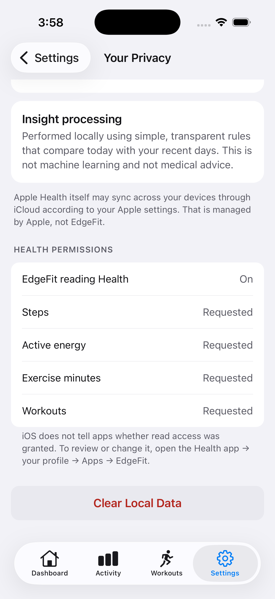

# EdgeFit

[](https://github.com/raviseta/edgefit/actions/workflows/ci.yml)
[](LICENSE)
[](#getting-started)
[](package.json)
[](package.json)
[](package.json)

A privacy-first fitness dashboard for iOS, built with React Native, Expo and TypeScript.
EdgeFit reads activity data from Apple Health, processes it **on the device**, stores
only processed daily summaries **on the device**, and generates simple, explainable
insights **on the device**. There is no account, no backend and no analytics SDK.

This is the MVP of a longer-term Edge-AI research project: the architecture is set up so
a deterministic rule engine can later be replaced by an on-device ML model without
touching the UI or data layers.

| Dashboard | Activity | Workouts |
| --- | --- | --- |
|  |  |  |

The three screenshots above use the built-in **demo data** (`normal` scenario), which is
why they show the "Demo data" banner. The two below come from **real HealthKit** on an iOS
26 simulator with data entered in the Health app: 8,420 steps and 420 kcal (shown in kJ).
Exercise minutes can't be entered by hand, so Active Time correctly shows "—".

| Dashboard (HealthKit) | Privacy Center (HealthKit) |
| --- | --- |
|  |  |

## Features

- **Onboarding** – welcome, privacy explanation, list of data types read, HealthKit
  permission request, and "Continue without access". No sign-up.
- **Dashboard** – today's steps, active energy, active time, workout count, Activity
  Score (with an on-demand breakdown) and the top insight.
- **Activity** – 7-day steps chart with average line, Activity Score trend, daily
  breakdown and all current insights. Missing days are drawn as dashed gaps.
- **Workouts** – workouts from the last 30 days: type, start time, duration, calories
  where recorded. EdgeFit reads workouts; it does not record them.
- **Privacy Center** – what is read, where it is stored, that no cloud processing is
  used, how insights are produced, permission status, and Clear Local Data.
- **Settings** – health access toggle, energy units (kcal / kJ), insights on/off, clear
  local data, About.
- Loading, empty, error, permission-denied and partial-sync states; pull-to-refresh;
  light and dark mode.

## Getting started

Requirements: macOS with Xcode 26+, Node 22+, CocoaPods.

```bash
npm install
```

```bash
npx expo run:ios
```

HealthKit needs a native build, so the app does not run in Expo Go. On a simulator,
add sample data in the **Health** app (Browse → Activity → Steps → Add Data, and the
same for Active Energy, Exercise Minutes and Workouts), then pull to refresh in EdgeFit.

To run with deterministic demo data instead of HealthKit (any platform):

```bash
EXPO_PUBLIC_HEALTH_PROVIDER=mock EXPO_PUBLIC_MOCK_SCENARIO=normal npx expo run:ios
```

Scenarios: `normal`, `high`, `low`, `empty`, `missingMetrics`, `multipleWorkouts`.

### Checks

```bash
npm run verify
```

Runs `tsc --noEmit`, ESLint and the Jest suite (unit + component tests). The same checks
run in GitHub Actions on every push and pull request ([`ci.yml`](.github/workflows/ci.yml)). Tests use the
mock health provider and Node's built-in SQLite, so they never depend on live HealthKit
data or a device.

## Architecture

```text
                  ┌──────────────────────────┐
                  │  React Native UI          │  src/app (routes), src/ui (screens, components)
                  └────────────┬─────────────┘
                               │ React Query hooks
                  ┌────────────▼─────────────┐
                  │  Application services     │  src/services (ActivityService, SyncService)
                  └──┬──────────┬─────────┬──┘
                     │          │         │
       ┌─────────────▼──┐ ┌─────▼─────┐ ┌─▼──────────────────────────┐
       │ HealthService   │ │Repositories│ │ ActivityIntelligenceService │
       │  (interface)    │ │ (SQLite)   │ │  (interface)                │
       └──┬───────────┬─┘ └───────────┘ └─┬──────────────────────────┘
          │           │                    │
   ┌──────▼─────┐ ┌───▼─────────┐  ┌───────▼──────────────────────┐
   │HealthKit    │ │MockHealth   │  │RuleBasedActivityIntelligence │  (MVP)
   │Service      │ │Service      │  │OnDeviceMLActivityIntelligence│  (future)
   └────────────┘ └─────────────┘  └──────────────────────────────┘
```

### Data pipeline

```text
Health platform data     HealthKitService: one statistics-collection query per metric,
        ↓                bucketed by local day (HealthKit de-duplicates iPhone + Watch)
Normalization            src/health/normalization.ts – DTOs → domain types, workout labels
        ↓
Domain models            src/domain/models.ts – ActivityData, DailySummary, Workout, …
        ↓
Aggregation + score      src/domain/aggregation.ts, activityScore.ts
        ↓
Local persistence        src/data – SQLite repositories, schema migrations
        ↓
Feature extraction       src/intelligence/features.ts – 7-day baseline, ratios, consistency
        ↓
Insights                 RuleBasedActivityIntelligenceService
```

### Key decisions

- **Dependency inversion.** UI code depends on `AppServices` (via a React context), never
  on HealthKit or SQLite directly. `createAppServices()` is the only place
  implementations are chosen, which is how tests inject the mock provider and an
  in-memory database.
- **Missing ≠ zero.** Metric fields are `number | null`. `null` means "no data reported"
  and renders as "—" or an empty state. A day with no data has no score.
- **Aggregates only.** HealthKit is queried for per-day sums, never raw samples, and only
  those sums are stored. Native workout objects are released after copying the few fields EdgeFit
  shows.
- **Recoverable failures.** If one metric query fails, the others still sync and a banner
  names the missing one. If every health query fails, cached data is shown with a
  warning. Database failures show a retryable error state. The logger records event
  names and error types only, never health values (tested).
- **Provider fallback.** iOS with HealthKit → `HealthKitService`; otherwise (Android,
  HealthKit unavailable, `EXPO_PUBLIC_HEALTH_PROVIDER=mock`) → `MockHealthService`, with a
  persistent "Demo data" banner. Android Health Connect is a future implementation of the
  same `HealthService` interface.

### Project layout

```text
src/
  app/            expo-router routes (thin wrappers)
  domain/         models, dates (DST-safe), aggregation, Activity Score
  health/         HealthService interface, HealthKit + mock implementations, fixtures
  data/           Database port, expo-sqlite adapter, migrations, repositories
  intelligence/   ActivityIntelligenceService, feature extraction, rule engine
  services/       SyncService, ActivityService, DI container
  ui/             screens, components, hooks, theme
  lib/            formatting, privacy-safe logger
  test-utils/     Node SQLite adapter, test harness
```

## Privacy model

| Question | Answer in this implementation |
| --- | --- |
| What is read? | Steps, active energy, exercise minutes, workouts. Read-only: no HealthKit write permission is requested. |
| Where is it stored? | An on-device SQLite database in the app sandbox: daily totals, workout summaries, insights, settings. |
| How long? | Processed data older than 30 days is deleted on every sync. |
| Does it leave the device? | Not via EdgeFit. The app code has no network calls and no analytics, ads, crash-reporting or tracking SDKs. A test (`src/services/__tests__/privacy.test.ts`) fails if `fetch`/`XMLHttpRequest`/`WebSocket` appear in app code or such SDKs are added. |
| How are insights made? | Locally, by fixed rules. Not machine learning, not medical advice. |
| Can I delete it? | Settings → Clear Local Data wipes every EdgeFit table. Apple Health data is untouched. |

Notes:

- iOS does not tell apps whether *read* access was granted. EdgeFit shows "Requested"
  rather than claiming "Allowed", and points users to Health → Profile → Apps → EdgeFit.
- Apple Health may sync between the user's own devices through iCloud. That is Apple's
  system, outside EdgeFit's control, and the Privacy Center says so.
- Development builds load JavaScript from the local Metro server; release builds bundle it.

## Activity Score

```text
Activity Score = 40% Steps + 30% Active Minutes + 30% Workout Activity
```

Full credit at 8,000 steps, 30 active minutes and 30 workout minutes. See
[docs/ACTIVITY_SCORE.md](docs/ACTIVITY_SCORE.md) for the full definition, missing-data
rules and a worked example.

## Insights

`RuleBasedActivityIntelligenceService` compares today with the previous 7 days:

| Insight | Rule |
| --- | --- |
| Above your usual level | today's steps ≥ 110% of the 7-day average (needs ≥ 3 days of history) |
| Right around your usual level | 90–110% |
| Below your usual level so far | < 90% |
| More active minutes than yesterday | today's exercise minutes > yesterday's |
| Consistent week | ≥ 5 of the last 7 days within ±25% of the average |
| Building your baseline | fewer than 3 days of step history |
| No activity recorded yet today | no steps or exercise minutes today |

## Path to on-device ML

The rule engine sits behind `ActivityIntelligenceService`. `features.ts` is the boundary
where processed activity becomes a feature vector. A future
`OnDeviceMLActivityIntelligenceService` would:

1. reuse `extractActivityFeatures()` (and extend it) as model input,
2. run a small model with an on-device runtime (Core ML / ExecuTorch / TFLite),
3. map predictions to the same `ActivityInsight` type,
4. set `method: 'on-device-ml'`, which the Privacy Center already handles.

It is wired in at a single line in `createAppServices()`. The rule engine stays as the
deterministic baseline to evaluate a model against.

## Out of scope for the MVP

Accounts, backend, cloud sync, social features, notifications, chat assistants,
nutrition, workout recording, Apple Watch app, medical recommendations, ML training, and
production Health Connect support.

## License

[MIT](LICENSE) © 2026 Ravi Seta
